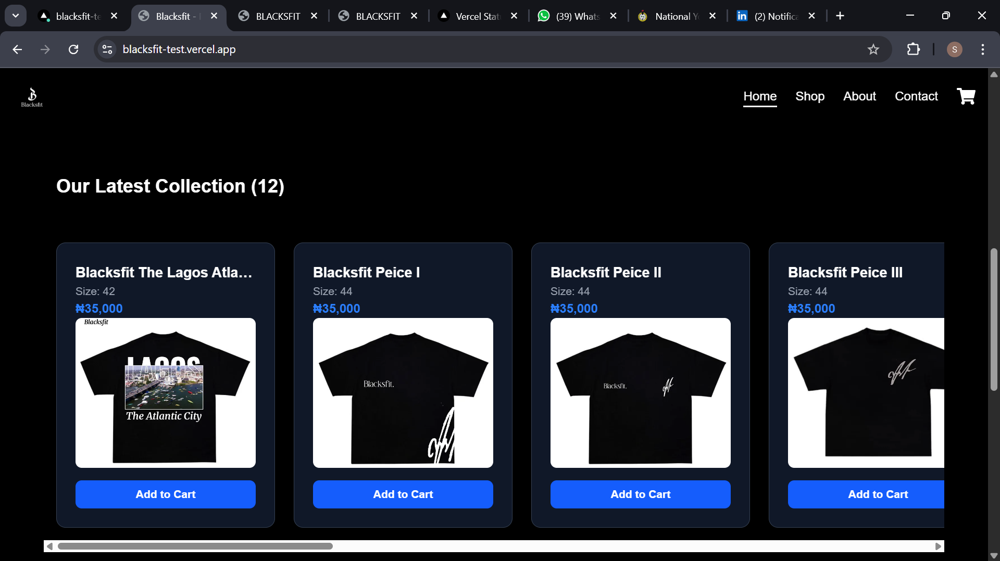

# 🖤 BLACKSFIT

**BLACKSFIT** is a premium fashion storefront built for minimalist lovers of bold, black-themed streetwear. This project is a sleek and modern frontend e-commerce application that allows users to browse, shop, and connect — all in one seamless experience.

🔗 [Live Demo](https://blacksfit.com)

---

##  Brand Story & Mission

> “BLACKSFIT was born from a vision to make **black fashion iconic again** — bold, minimal, and powerful. We blend streetwear culture with timeless design for individuals who express themselves through simplicity.”

Our mission is to **redefine fashion identity through black-focused designs** while making online shopping accessible and immersive for everyone.

---

##  Features

- 🛍 **Product Catalog** – View our curated collection of BLACKSFIT apparel
- 🧺 **Cart Functionality** – Add items to your cart with dynamic button states
- 💳 **(Planned) Checkout Integration** – Future support for Paystack or Flutterwave
- 📨 **Customer Contact Form** – Built-in contact page to receive inquiries
- 📱 **Fully Responsive** – Optimized for all screen sizes and devices
- 🌙 **Dark UI Theme** – Sleek black-themed interface to reflect the brand
- 🚀 **Hosted on Vercel** – Fast performance with global CDN

---

## 🧰 Tech Stack

| Tech | Purpose |
|------|---------|
| **Next.js** | App framework with file-based routing and SSR |
| **Tailwind CSS** | Utility-first styling framework |
| **TypeScript** | Adds static typing for better development |
| **Framer Motion** | Smooth animations and transitions |
| **EmailJS** | Customer contact form integration |
| **Redux** |State Management|
| **Vercel** | Hosting and deployment platform |

---

## 📦 Folder Structure (Simplified)

blacksfit/
├── public/ # Static files (images, icons)
├── src/
│ ├── components/ # Reusable components (Navbar, Footer, ProductCard)
│ ├── pages/ # Next.js routing pages (Home, Shop, Contact, etc.)
│ ├── styles/ # Tailwind and global styles
│ └── data/ # Product data (static/mock)
├── tailwind.config.js # Tailwind CSS configuration
├── next.config.js # Next.js setup
└── README.md # Project documentation


---

## 📸 UI Preview

> A clean and elegant interface that showcases BLACKSFIT’s latest collection:



---

## 📬 Contact Form

We integrated **Formspree** to handle customer inquiries.  
Users can fill out the **Contact** form to request custom sizes, delivery options, or ask any brand-related questions.

**Contact Page:** `/contact`  
Handles: Full name, Email address, Message

---

## 🛒 Payment Integration (Planned)

Future improvements include integrating a secure checkout flow using:

- **Paystack** (for Nigerian payments)
-

Planned flow:
1. Add to Cart
2. Proceed to Checkout
3. Select Payment Method
4. Complete Purchase

Currently under development.

---

## 🚀 Getting Started

### 1. Clone the Repository

```bash
git clone https://github.com/shittu-qudus/BLACKSFIT
cd BLACKSFIT


 Install Dependencies
bash
npm install
# or
yarn install

Open http://localhost:3000 to view the Web app

Author
Built by Shittu Qudus Adekunle
📍 Nigeria — Frontend Developer (React/Next.js)

LinkedIN- https://ng.linkedin.com/in/shittu-qudus-5787762ab

Portfolio- https://my-portofolio-4ssz.vercel.app/

GitHub- https://github.com/shittu-qudus